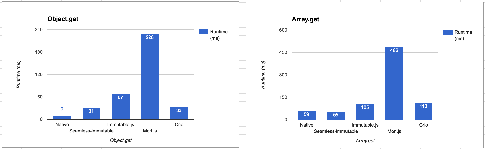
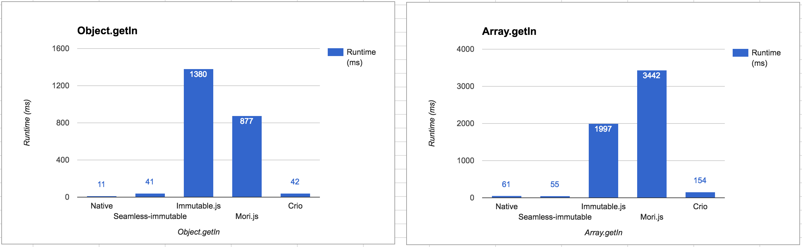
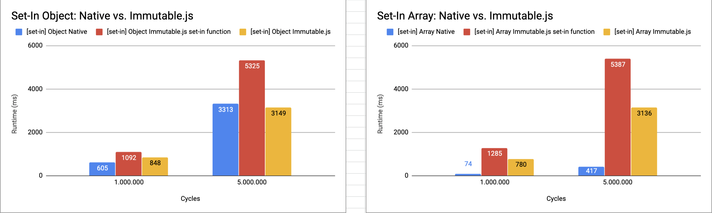
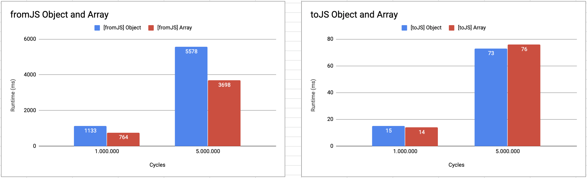

# Benchmark of Javascript vs Immutable.js

## Running locally

1. Clone this repository
2. Execute `npm i`
3. Execute `npm run start`
4. Results will be saved to `results.csv` file.

## Results

Documented in [this sheets](https://docs.google.com/spreadsheets/d/1wnQe7aeL46OtjlgyhhW2z_g8Vx1mLV8nMgdjvGLDZfM/edit?usp=sharing).

