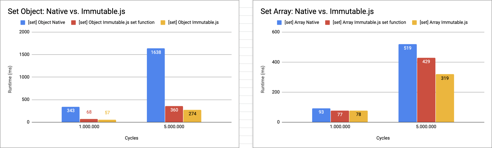

Benchmark of Javascript Immutability Libraries
==============================================

This repo contains benchmarks that compare performance of a set of javascript immutability libraries.  
Currently included libraries:
- [Immutable.js](https://facebook.github.io/immutable-js/)
- [Mori.js](http://swannodette.github.io/mori/)
- [Seamless-Immutable](https://github.com/rtfeldman/seamless-immutable)
- [Crio](https://github.com/planttheidea/crio)

## Running locally

1. Clone this repository
2. Execute `npm install`
3. Execute `npm start`
4. Results will be saved to `results.csv` file.

## Results

Below you can find charts of the results after 5000000 cycles executed on a MacBook Pro with i7@2.3GHz, 16GB RAM@1600MHz and Node.js v6.2.2.

