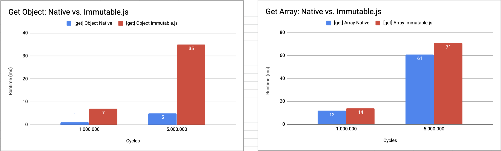
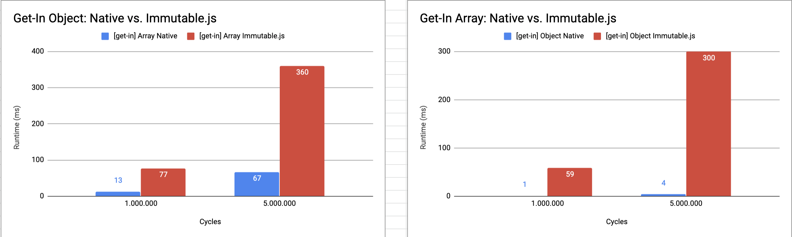

# Benchmark of Javascript vs Immutable.js

## Running locally

1. Clone this repository
2. Execute `npm install`
3. Execute `npm start`
4. Results will be saved to `results.csv` file.

## Results

